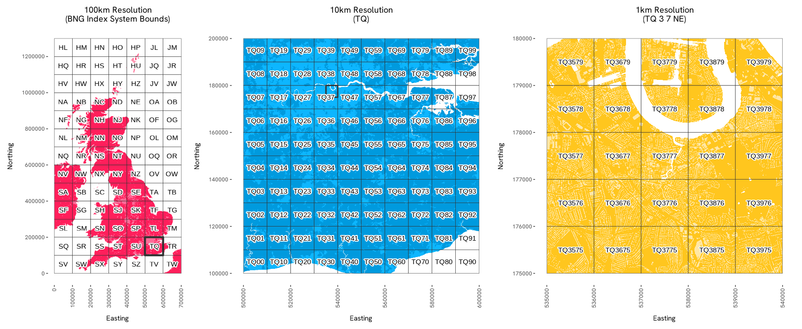
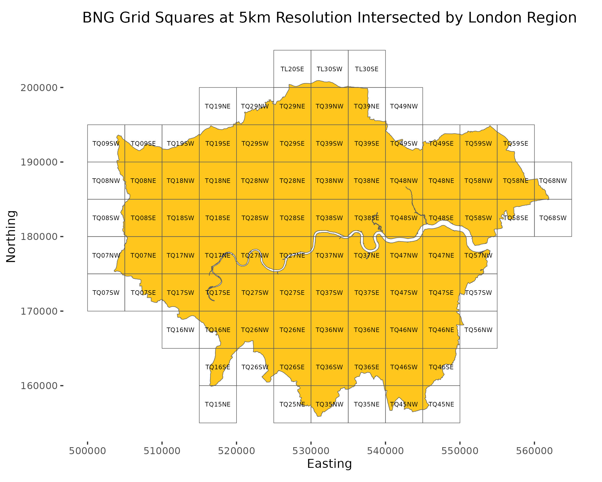
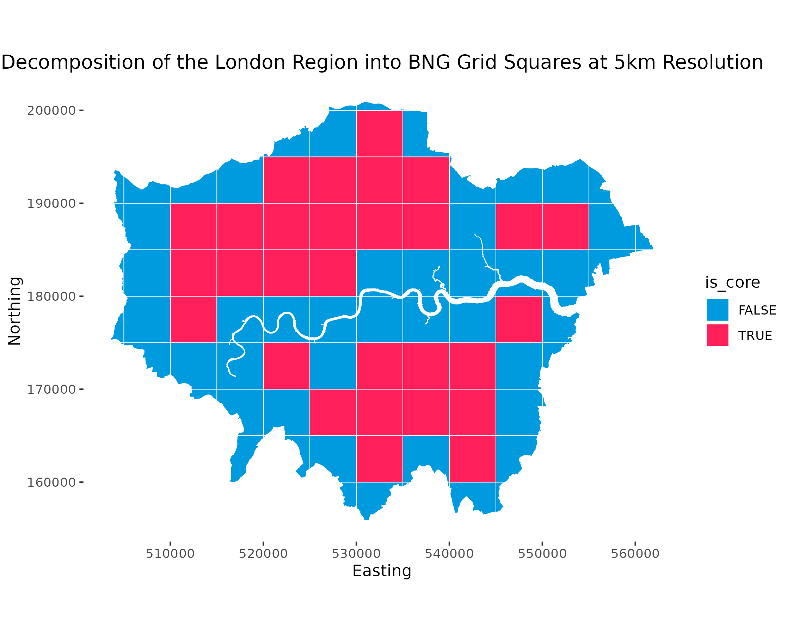

<!-- README.md is generated from README.Rmd. Please edit that file -->

```{r, include = FALSE}
knitr::opts_chunk$set(
  collapse = TRUE,
  comment = "#>",
  fig.path = "man/figures/README-",
  out.width = "100%"
)
```

# osbng: British National Grid References in R

An R library for Ordnance Survey's British National Grid (BNG) index system.
This library provides tools for working with the BNG, a rectangular Cartesian
grid system used to identify and index locations across Great Britain into grid
squares at various resolutions.


## Overview

The `osbng` R package provides a programmatic interface to the BNG, supporting
efficient grid-based indexing and spatial analysis. This enables applications
such as statistical aggregation, data visualisation, and data interoperability
using BNG grid references. Designed for developers working with geospatial data
in the context of Great Britain, the library offers tools to simplify working
with the BNG, facilitating both technical integration into geospatial workflows
and practical exploration of the index system's structure.

The package supports the 'standard' BNG metre-based resolutions, which represent
powers of ten from 1m to 100km (1m, 10m, 100m, 1km, 10km, 100km). It also
supports the 'intermediate' quadtree resolutions (5m, 50m, 500m, 5km, 50km),
identified by an ordinal (NE, SE, SW, NW) BNG reference direction suffix.

 <!-- -->

## Installation

Currently, you can install the latest version of `osbng` from
[GitHub](https://github.com/OrdnanceSurvey/osbng-r) with:

```{r, eval=FALSE}
remotes::install_github("OrdnanceSurvey/osbng-r")
```

Once installed, load the package to use it:

```{r, eval=FALSE}
library(osbng)
```

### Complimetary tools

* [`osbng-py`](https://github.com/OrdnanceSurvey/osbng-py), a Python package with broad parity to the `R` package.
* [`osbng-grids`](https://github.com/OrdnanceSurvey/osbng-grids), for BNG grid data in GeoParquet and GeoPackage (GPKG) formats.
* [`mosaic`](https://github.com/databrickslabs/mosaic), a Databricks package providing geospatial grid indexing using the BNG for Apache Spark.


## Usage

The `osbng` package supports different interactions with the BNG index system
(e.g. indexing, hierarchy, traversal). A high-level summary of each task is
provided below:

### BNG Reference

`osbng` implements a custom BNG reference object, `BNGReference`. The
`BNGReference` object validates the reference and provides access to custom
functions to work with the reference.

```{r}
library(osbng)

bng_ref <- as_bng_reference("ST57SE")

print(bng_ref)

get_bng_resolution(bng_ref)

get_bng_resolution_string(bng_ref)
```

### Indexing

Provides the ability to index and work with coordinates and geometries against
the BNG index system. This includes:

* Encoding easting and northing coordinates into `BNGReference` objects at a specified resolution.
* Decoding `BNGReference` objects back into coordinates, bounding boxes and grid squares as [`geos`](https://cran.r-project.org/package=geos) geometries.
* Indexing bounding boxes and `geos` geometries into grid squares at a specified resolution for spatial analysis.

<!-- -->

<!-- -->

The following example demonstrates a round trip of constructing a `BNGReference`
object from easting and northing coordinates, and then decoding back into
coordinates, bounding box, and geos geometry:

```{r}
bng_ref <- xy_to_bng(easting = 356976, northing = 171421, resolution = "5km")

bng_to_xy(bng_ref, position = "lower-left")

bng_to_bbox(bng_ref)

bng_to_grid_geom(bng_ref, "wkt")
```

### Hierarchy

Provides functionality to navigate the hierarchical structure of the BNG index
system. This includes:

* Returning parents and children of `BNGReference` objects at specified resolutions.

The following example returns a parent of a `BNGReference`:

```{r}
bng_ref <- as_bng_reference("ST5671SE")

get_bng_resolution(bng_ref)

bng_to_parent(bng_ref, resolution = "10km")
```

### Traversal

Provides functionality for traversing and calculating distances within the BNG
index system. It supports spatial analyses such as distance-constrained nearest
neighbour searches and 'distance within' queries by offering:

* Generation of k-discs and k-rings around a given grid square.
* Identification of neighbouring grid squares and checking adjacency.
* Calculating the distance between grid square centroids.
* Retrieving all grid squares within a specified absolute distance.

The following example creates a hollow ring of grid squares a distance of *k*
grid squares:

```{r}
bng_kring(as_bng_reference("SU1234"), k = 2)
```

### Grids

Provides functionality to generate BNG grid square data within specified bounds. This includes:

 * Grid square data covering the BNG index system bounds at 100km, 50km, 10km, 5km and 1km resolutions.
 * Grid squares can be filtered to specific regions of interest.

This functionality requires the `sf` package to be available. The following
example constructs an `sf` data frame:

```{r}
library(sf)

bng_grid_100km()
```


## Contributing

Please raise an issue to discuss features, bugs, or ask general questions.

## License

`osbng` is licensed under the terms of the MIT License.
